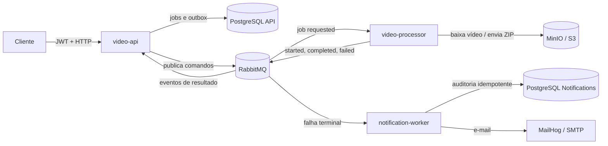

# FIAP X — Processamento assíncrono de vídeos

## Summary

O FIAP X recebe referências de vídeos armazenados em object storage, cria jobs assíncronos, extrai frames com FFmpeg, gera um ZIP e registra o resultado para consulta. A solução foi organizada como um monorepo Maven com três aplicações Spring Boot independentes, comunicação por eventos e propriedade de dados bem definida.

> Estado atual: o `video-processor` está implementado, com testes unitários. O `video-api` e o `notification-worker` seguem como fundação — contratos, migrations, imagens e ambiente local estruturados, sem código de aplicação. Upload/download por URL pré-assinada, emissão de tokens, autorização por proprietário e testes de integração são evoluções registradas, não funcionalidades concluídas.

## Visão geral



Veja a [arquitetura detalhada](docs/architecture/architecture.md), o [catálogo de eventos](docs/architecture/event-catalog.md) e as [decisões arquiteturais](docs/adr/README.md).

## Aplicações

| Aplicação | Responsabilidade | Porta | Documentação |
|---|---|---:|---|
| `video-api` | Autorização JWT, jobs, outbox e aplicação dos resultados | 8080 | [README](services/video-api/README.md) |
| `video-processor` | FFprobe, FFmpeg, ZIP e object storage | 8081 | [README](services/video-processor/README.md) |
| `notification-worker` | Notificação de falhas terminais e auditoria | 8082 | [README](services/notification-worker/README.md) |

Os módulos não dependem uns dos outros no Maven. Cada aplicação possui configuração, Dockerfile, health check e ciclo de execução próprios.

## Stack

- Java 21, Spring Boot 3.5 e Maven Wrapper;
- Spring Web, Security, OAuth2 Resource Server, Data JPA e AMQP;
- PostgreSQL e Flyway;
- RabbitMQ com retry limitado e dead-letter queues;
- MinIO local e API compatível com S3;
- FFprobe/FFmpeg;
- Actuator, Micrometer e Prometheus;
- MailHog no ambiente local;
- JUnit 5, AssertJ, Mockito e Testcontainers disponíveis para testes.

## Estrutura do repositório

```text
.
├── contracts/                 # OpenAPI e AsyncAPI
├── docs/
│   ├── adr/                   # decisões e trade-offs
│   └── architecture/          # diagramas, fluxos e atributos de qualidade
├── infra/postgres/            # bootstrap do banco local
├── services/
│   ├── video-api/
│   ├── video-processor/
│   └── notification-worker/
├── .github/workflows/ci.yml
├── docker-compose.yml
└── pom.xml
```

## Fluxo de negócio

1. O cliente envia à API a `sourceKey` de um vídeo previamente armazenado.
2. A API persiste o job `PENDING` e o evento de outbox na mesma transação.
3. O publicador da outbox envia `video.job.requested.v1` ao RabbitMQ.
4. O processor baixa e valida o vídeo, publica `PROCESSING`, extrai frames e gera o ZIP.
5. O ZIP é armazenado e `video.job.completed.v1` informa sua `resultKey`.
6. A API atualiza o job em seu próprio banco. Em falha terminal, o worker também envia uma notificação.

O fluxo completo, incluindo retry e DLQ, está no [documento de arquitetura](docs/architecture/architecture.md).

## Como executar localmente

### Pré-requisitos

- Docker Engine com Docker Compose v2;
- JDK 21 para executar builds fora dos containers;
- portas `5432`, `5672`, `8080–8082`, `8025`, `9000`, `9001` e `15672` livres.

### Subir o ambiente

```bash
cp .env.example .env
docker compose up --build
```

### Endpoints locais

| Recurso | URL |
|---|---|
| Video API | `http://localhost:8080` |
| Health da API | `http://localhost:8080/actuator/health` |
| RabbitMQ Management | `http://localhost:15672` |
| MinIO Console | `http://localhost:9001` |
| MailHog | `http://localhost:8025` |

Credenciais locais vêm do `.env`; os valores de `.env.example` destinam-se somente a desenvolvimento.

## Build e verificação

O `spring-boot:repackage` continua desabilitado no `pom.xml` raiz porque
`video-api` e `notification-worker` ainda não possuem classe principal. Cada
módulo reativa o repackage sobrescrevendo `spring-boot.repackage.skip` quando
ganha sua aplicação, como já faz o `video-processor`. Quando os três módulos
tiverem código, remova a propriedade da raiz.

```bash
./mvnw clean verify
./mvnw -pl services/video-api -am verify
./mvnw -pl services/video-processor -am verify
./mvnw -pl services/notification-worker -am verify
docker compose config --quiet
```

## Contratos

- [OpenAPI](contracts/openapi.yaml): endpoints HTTP atuais para criação e consulta de jobs.
- [AsyncAPI](contracts/asyncapi.yaml): canais e schemas dos eventos versionados.

O routing key inclui a versão (`.v1`). Mudanças incompatíveis exigem uma nova versão do contrato e uma estratégia de convivência entre produtores e consumidores.

## Configuração e segurança

Configuração é externalizada por variáveis de ambiente. Nunca use os segredos padrão fora do ambiente local. A API valida JWT HMAC, mas esta fundação não emite tokens. Em ambientes reais, prefira um provedor OIDC, chaves assimétricas, rotação de credenciais, TLS e secret manager.

Payloads binários não passam pelo RabbitMQ ou PostgreSQL. Vídeos e ZIPs ficam no object storage; mensagens carregam apenas IDs, object keys e metadados pequenos.

## Observabilidade

Cada aplicação expõe liveness/readiness pelo Actuator e métricas em `/actuator/prometheus`. Logs estruturados, tracing distribuído, dashboards e alertas são próximos passos documentados em [atributos de qualidade](docs/architecture/quality-attributes.md).

## CI/CD

O workflow [`.github/workflows/ci.yml`](.github/workflows/ci.yml) executa em pushes e pull requests, prepara Java 21, usa cache Maven, roda `clean verify` e valida o Compose. O pipeline atual é de CI: publicação de imagens, análise de vulnerabilidades, assinatura de artefatos e deploy ainda devem ser adicionados conforme o registry e o ambiente alvo forem definidos.

## Decisões e limites

- PostgreSQL é a fonte de verdade; cada bounded context possui seus dados.
- O processor nunca atualiza tabelas da API.
- A entrega é pelo menos uma vez e consumidores devem ser idempotentes.
- Retry é limitado e falhas esgotadas seguem para DLQ.
- Redis e Kubernetes foram deliberadamente adiados até existir necessidade mensurável.

## Roadmap

- Upload/download por URLs pré-assinadas e bucket policies;
- autenticação completa e autorização de propriedade do job;
- deduplicação no consumidor de resultados da API (o processor já deduplica pelo `resultKey` determinístico);
- claim concorrente e confirmação robusta da outbox;
- testes de integração com Testcontainers e end-to-end;
- logs JSON, tracing, dashboards, alertas e runbooks;
- build/push de imagens, SBOM, scan e promoção entre ambientes.

## Documentação

- [Arquitetura e fluxos](docs/architecture/architecture.md)
- [Catálogo de eventos](docs/architecture/event-catalog.md)
- [Atributos de qualidade](docs/architecture/quality-attributes.md)
- [Justificativa do monorepo](docs/architecture/monorepo-justification.md)
- [Índice de ADRs](docs/adr/README.md)
