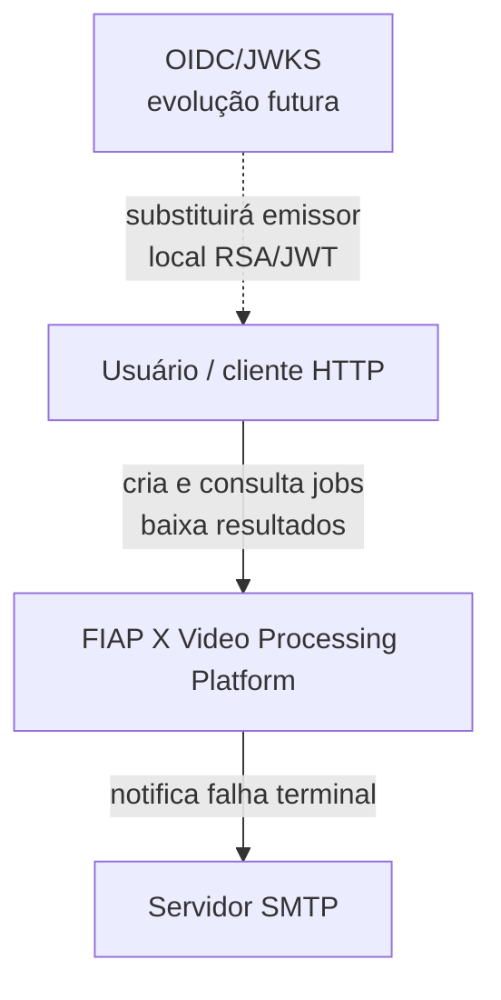
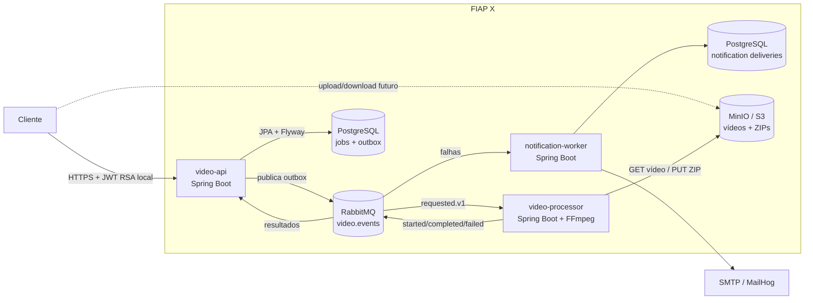
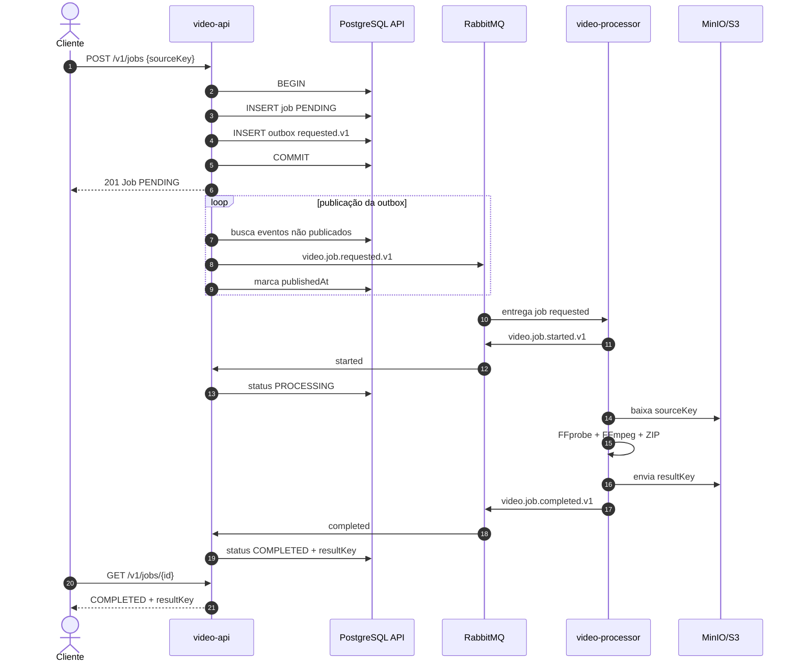
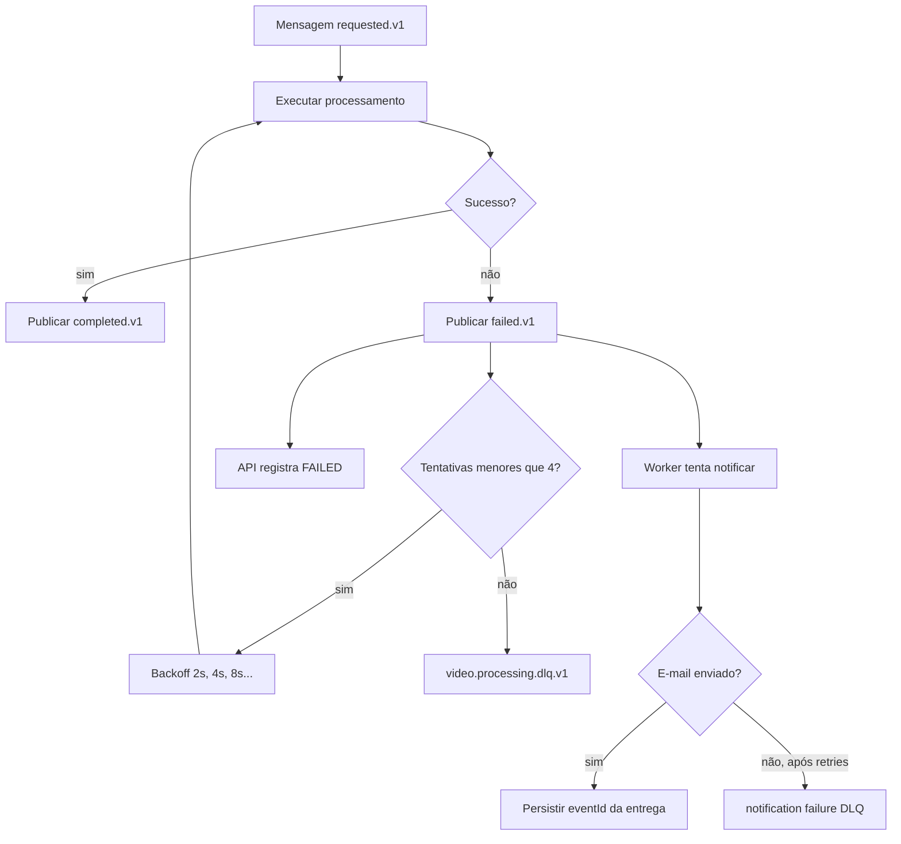
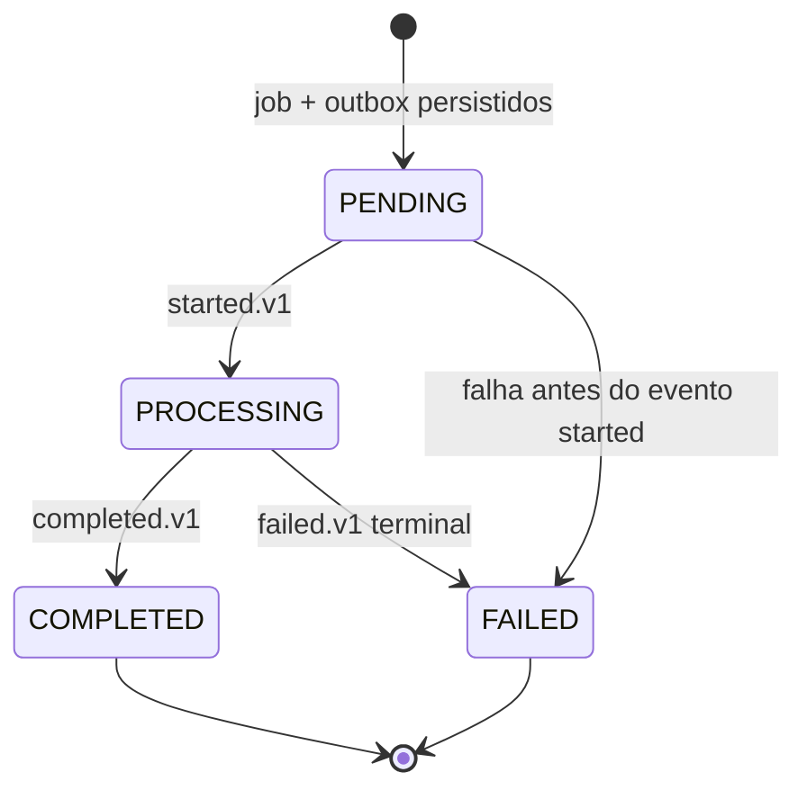
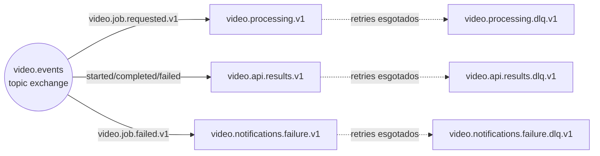
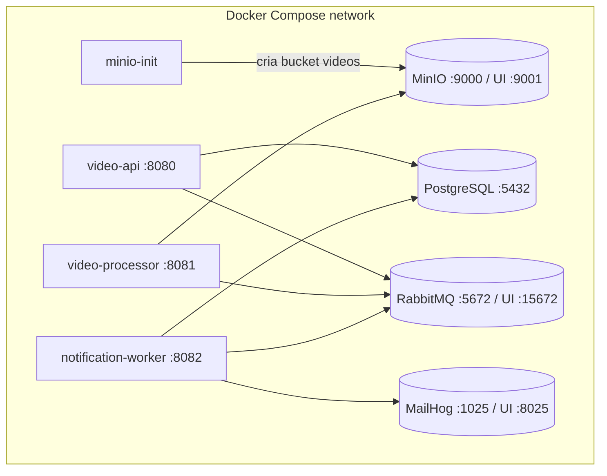

# Arquitetura da solução

## Objetivo e escopo

Esta arquitetura separa a interação HTTP, o processamento pesado de mídia e a notificação de falhas. O objetivo é
absorver picos, permitir escala independente e impedir que operações longas de FFmpeg consumam recursos da API. O
desenho abaixo é o alvo do produto. O `video-api` já cadastra usuários, emite e
valida JWTs locais, persiste jobs de seus proprietários e registra a intenção na
outbox. Upload/confirmação de vídeo e a integração da outbox/inbox com RabbitMQ
continuam no roadmap.

## Diagrama de contexto

## Diagrama de containers

## Responsabilidades e propriedade

| Componente            | Responsabilidades                                                       | Dados próprios                   | Não deve fazer                                             |
|-----------------------|-------------------------------------------------------------------------|----------------------------------|------------------------------------------------------------|
| `video-api`           | cadastro/login/sessão, validar JWT, criar/consultar jobs do proprietário e registrar outbox; resultado por listener ainda é futuro | usuários, sessões, vídeos, jobs, histórico, inbox, outbox | processar mídia ou acessar banco de notificações           |
| `video-processor`     | validar vídeo, extrair frames, gerar ZIP, publicar resultados           | arquivos temporários efêmeros    | atualizar tabelas da API ou transportar binários no broker |
| `notification-worker` | consumir falhas terminais, enviar e-mail, auditar entrega               | entregas de notificação          | consultar jobs/usuários diretamente no banco da API        |
| RabbitMQ              | filas de trabalho, fan-out lógico, retry e DLQ                          | mensagens pequenas e temporárias | armazenar vídeos ou ZIPs                                   |
| MinIO/S3              | objetos de entrada e saída                                              | vídeo e ZIP                      | atuar como fonte de verdade do estado do job               |

## Fluxo principal (alvo)

O passo de persistência da API já existe, mas o fluxo não pode ser concluído
pela API atual: não há endpoint para confirmar vídeo nem publisher/listener AMQP
conectado ao broker.

## Fluxo de falha, retry e DLQ

Publicar `failed.v1` em cada tentativa pode produzir notificações prematuras na implementação inicial. A evolução
recomendada é classificar erros e publicar falha terminal somente depois de esgotar o retry, preferencialmente por um
recoverer associado à DLQ.

## Estados do job

Transições duplicadas precisam ser seguras, pois a entrega é pelo menos uma vez. Regressões de estado e eventos fora de
ordem devem ser rejeitados quando a máquina de estados for endurecida.

## Topologia RabbitMQ

## Diagrama de implantação local

Em produção, cada aplicação deve ser uma unidade de deploy independente. Banco, broker, storage e SMTP devem ser
serviços gerenciados ou operados com políticas próprias de backup, disponibilidade, TLS e credenciais.

## Consistência e garantias

- Criar o job e registrar a intenção de publicação é atômico dentro do banco da API.
- A API possui operações de claim/retry na outbox e persistência para inbox, mas
  ainda não há publisher RabbitMQ nem listener de resultados configurados.
- Quando os consumidores forem conectados, entrega pelo menos uma vez e
  deduplicação por `eventId` continuam requisitos obrigatórios.
- A tabela do notification worker já possui `event_id` único. A integração de
  deduplicação do processor e do listener da API permanece no roadmap.
- Object storage e banco têm consistência eventual: o job só deve virar `COMPLETED` depois que o upload do ZIP
  finalizar.

## Segurança

A API exige bearer JWT para jobs e usa o `sub` validado para limitar consultas e
criações ao proprietário. Cadastro, login, refresh rotativo e logout pertencem
ao serviço; o emissor usa RSA/JWT local e tem fronteira documentada para futura
migração a OIDC/JWKS. Object keys não devem ser expostas como autorização de
acesso; URLs pré-assinadas curtas e validação de propriedade devem mediar upload
e download quando esse fluxo for implementado. Produção também requer TLS,
chaves assimétricas externas, rotação de segredos, usuário de banco por serviço
e políticas mínimas de bucket e RabbitMQ.

## Observabilidade e operação

Actuator oferece health/probes nesta fundação; o restante da observabilidade do produto ainda pede logs estruturados com
`jobId`/`eventId`, tracing entre HTTP e AMQP, métricas de lag, idade da outbox, duração de FFmpeg, taxa de falha,
profundidade das DLQs, dashboards e alertas. Consulte [quality-attributes.md](quality-attributes.md).

## Lacunas conhecidas

1. Upload/download por URL pré-assinada e confirmação de vídeo ainda não foram implementados.
2. A API emite JWT RSA local; a migração para OIDC/JWKS está documentada no ADR 0011.
3. Processor e API result listener ainda precisam ser conectados à inbox e à deduplicação persistente já modelada.
4. O publisher da outbox precisa ser integrado ao RabbitMQ com confirms e recuperação explícita.
5. Há testes unitários e de integração; os de Testcontainers exigem Docker e a cobertura atual não alcança o gate de 70%.
6. Eventos de falha devem carregar o destinatário ou uma referência resolvível sem acesso ao banco da API.
7. A política de retenção e limpeza de objetos temporários ainda deve ser definida.
