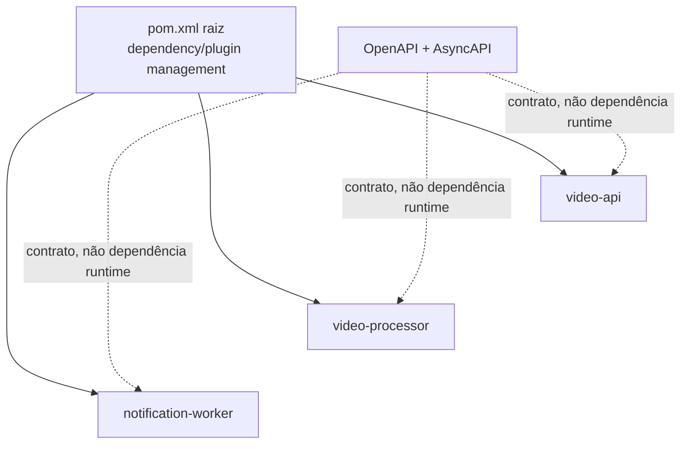

# Estratégia do monorepo

## Summary

O monorepo foi escolhido para reduzir custo de coordenação na fase inicial sem transformar os três serviços em uma única unidade de runtime. Compartilhar repositório não significa compartilhar domínio, banco, deploy ou escala.

## O que é compartilhado

- parent POM e versões de plugins/dependências;
- Maven Wrapper e padrões de build;
- contratos OpenAPI/AsyncAPI;
- documentação, ADRs e ambiente local;
- workflow básico de CI.

## O que permanece independente

- código e POM de cada aplicação;
- configuração e secrets;
- Dockerfile e imagem;
- banco lógico e migrations quando aplicável;
- health check, réplicas, recursos e rollout;
- ownership dos dados e ciclo de execução.

Não existem arestas de dependência Maven entre os serviços. Um módulo comum só será aceito para contratos ou utilitários técnicos mínimos, nunca para entidades JPA, repositories ou regras de domínio.

## Trade-offs

| Benefício | Custo/Risco | Controle |
|---|---|---|
| mudança de contrato e consumidores na mesma PR | PRs podem ficar grandes | ownership e revisão por área |
| versões centralizadas | atualização pode afetar todos | build isolado e matriz de CI |
| onboarding simples | sensação de release acoplado | tags/imagens por serviço |
| uma visão arquitetural | permissões menos granulares | CODEOWNERS e proteção de paths |

## Estratégia de CI/CD

O CI atual valida o reator completo. A evolução recomendada detecta paths alterados, executa build/teste do módulo correspondente e sempre valida contratos quando `contracts/` mudar. Imagens devem ter nome e tag por serviço, além do SHA do commit. Promoção deve usar o mesmo digest entre ambientes, sem rebuild.

## Critérios de extração

Separar um serviço em repositório próprio quando pelo menos um destes fatores se tornar persistente:

- equipes e permissões independentes;
- cadências de release incompatíveis;
- CI do monorepo ultrapassa o tempo alvo mesmo com seleção por paths;
- exigência regulatória ou de isolamento;
- volume de mudanças cruzadas se torna baixo e a coordenação por contrato amadurece.

A extração deve preservar histórico, ownership dos contratos e compatibilidade de eventos; não deve criar biblioteca de domínio compartilhada para compensar a separação.
