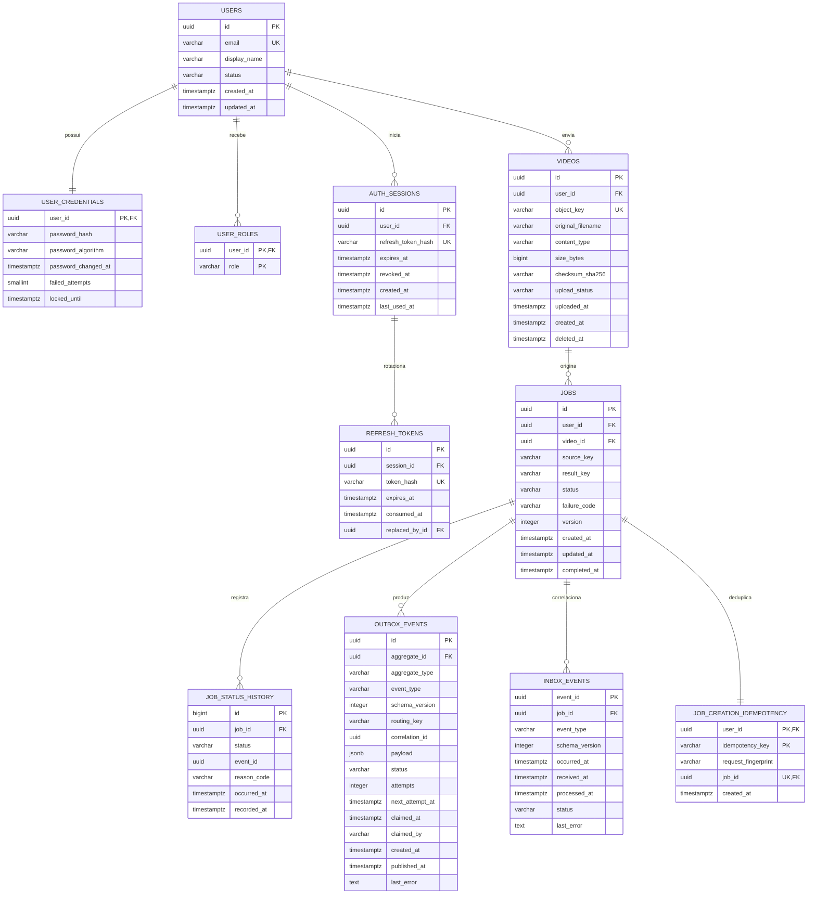

# DER do `video-api`

## Objetivo

Este modelo cobre cadastro e autenticação local de usuários, upload direto para
object storage compatível com S3, submissão assíncrona de processamento, histórico
de estado, publicação confiável pelo padrão transactional outbox e consumo
idempotente dos resultados do processor.

O PostgreSQL é a fonte de verdade dos metadados. Os binários permanecem no S3 e
as mensagens no RabbitMQ carregam somente identificadores, object keys e
metadados pequenos.

## Diagrama entidade-relacionamento



## Responsabilidade das tabelas

| Tabela | Responsabilidade |
|---|---|
| `users` | perfil e estado da conta; e-mail normalizado e único |
| `user_credentials` | credencial local separada do perfil; guarda somente hash forte da senha |
| `auth_sessions` | refresh tokens rotacionáveis e revogáveis; access token JWT continua stateless |
| `videos` | metadados e ciclo de vida do objeto enviado ao S3 |
| `jobs` | agregado proprietário do processamento e seu estado atual |
| `job_status_history` | trilha append-only de todas as transições aceitas |
| `outbox_events` | intenção durável de publicar `video.job.requested.v1` |
| `inbox_events` | deduplicação durável de `started`, `completed` e `failed` |

## Decisões importantes

### S3: persistir a chave, não a URL assinada

Apesar de o requisito mencionar armazenar a URL, a coluna canônica deve ser
`object_key` (`source_key`/`result_key`). URLs pré-assinadas expiram e não devem
ser usadas como identidade do objeto. A API valida o proprietário e gera uma URL
curta no momento do upload ou download. Se houver URL pública permanente, ela
pode ser derivada da configuração do bucket/CDN sem duplicá-la em todas as
linhas.

O fluxo recomendado é:

1. a API cria `videos` com `upload_status = 'PENDING'` e devolve URL pré-assinada;
2. o cliente envia o binário diretamente ao S3, sem passar pela API;
3. a API confirma tamanho, tipo e checksum e muda para `UPLOADED`;
4. na mesma transação, cria `jobs` em `PENDING`, o primeiro histórico
   e `outbox_events` com `video.job.requested.v1`;
5. o publisher envia a mensagem e somente depois do publisher confirm marca a
   outbox como `PUBLISHED`.

### Cadastro e login

Este DER assume autenticação local porque cadastro e login foram definidos como
responsabilidade do serviço. Senhas nunca são armazenadas; somente hash Argon2id
ou bcrypt. O hash do refresh token também é persistido, permitindo revogação sem
armazenar o token em claro.

Se a decisão final for OIDC/JWKS, `user_credentials` e `auth_sessions` saem deste
bounded context. `users.id` permanece como identidade local, associada ao
`issuer + subject` do provedor. Isso resolve a divergência atual entre o requisito
de login e a implementação documentada, que hoje apenas valida JWT.

### Outbox e inbox

Job, histórico inicial e outbox são gravados em uma única transação. O publisher
faz claim concorrente em pequenos lotes com `FOR UPDATE SKIP LOCKED`, usa
publisher confirms e aplica retry com `next_attempt_at`. Como envio e atualização
da outbox não são atômicos, consumidores continuam idempotentes por `eventId`.

O listener de resultados insere primeiro em `inbox_events`. A unique key de
`event_id` elimina redelivery; a inserção na inbox, a validação da transição, a
atualização do job e o histórico ocorrem na mesma transação. Eventos antigos não
podem regredir `COMPLETED` ou `FAILED`.

## Constraints recomendadas

- `users.email`: `UNIQUE (lower(email))`, ou tipo `citext` se a extensão estiver
  aprovada;
- `videos`: `UNIQUE (user_id, object_key)` e checks para tamanho positivo e
  estados válidos;
- `jobs`: `video_id`, proprietário e `version` impedem inconsistência e atualização perdida
  para impedir processar vídeo de outro usuário; `version` para optimistic lock;
- `job_status_history`: `UNIQUE (job_id, event_id)` quando `event_id` existir;
- `outbox_events`: `payload jsonb NOT NULL`, `attempts >= 0` e estado limitado a
  `PENDING`, `PROCESSING`, `PUBLISHED`, `FAILED`;
- `inbox_events.event_id`: chave primária e, portanto, chave de idempotência;
- timestamps em UTC (`timestamptz`) e UUIDs para agregados e eventos.

Enums de negócio podem começar como `varchar + CHECK`, facilitando evolução
forward-only sem o acoplamento operacional de enums nativos do PostgreSQL.

## Índices para escala

```sql
CREATE INDEX jobs_owner_created_idx
    ON jobs (user_id, created_at DESC, id);

CREATE INDEX jobs_owner_status_idx
    ON jobs (user_id, status, created_at DESC);

CREATE INDEX job_history_job_time_idx
    ON job_status_history (job_id, occurred_at, id);

CREATE INDEX outbox_ready_idx
    ON outbox_events (next_attempt_at, created_at)
    WHERE status = 'PENDING';

CREATE INDEX inbox_retention_idx
    ON inbox_events (processed_at)
    WHERE status = 'PROCESSED';

CREATE INDEX auth_sessions_active_idx
    ON auth_sessions (user_id, expires_at)
    WHERE revoked_at IS NULL;
```

A listagem de jobs deve usar paginação por cursor `(created_at, id)`, nunca
offset em tabelas grandes. Histórico, inbox e outbox precisam de política de
retenção/arquivamento. Particionamento por mês só deve ser introduzido após
métricas mostrarem volume suficiente; as primeiras candidatas são outbox, inbox
e histórico.

## Relação com o schema atual

O schema existente já contém `jobs`, `job_status_history` e `outbox_events`. A
evolução deve ocorrer em novas migrations Flyway, sem alterar
`V1__api_schema.sql`:

1. criar `users`, `user_credentials`, `auth_sessions`, `videos` e
   `inbox_events`;
2. adicionar metadados operacionais à outbox e converter `payload` para `jsonb`;
3. adicionar `video_id`, `version`, códigos de falha e timestamps ao job;
4. popular/validar relações antes de tornar novas FKs e colunas obrigatórias;
5. manter `source_key` e `result_key` durante a compatibilidade com os contratos
   OpenAPI/AsyncAPI atuais.

Essa sequência permite rollout expand/contract e instâncias antigas e novas
convivendo durante o deploy.
