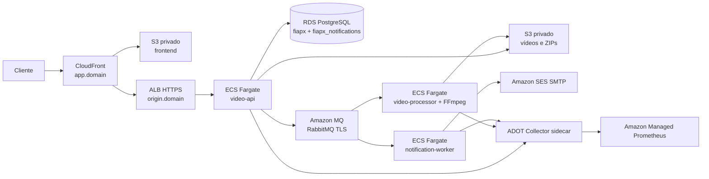

# Infraestrutura AWS

Esta documentação descreve a infraestrutura Terraform em `infra/aws/terraform` e o fluxo de implantação do FIAP X.
O deployment de produção é autorizado somente pela branch `main`.

## Arquitetura

O frontend e a API usam a mesma origem pública. O CloudFront serve a SPA via Origin Access Control e encaminha `/v1/*`
ao ALB. O origin do ALB usa TLS e um header secreto enviado pela distribuição; o security group do ALB aceita tráfego
somente do prefix list gerenciado da CloudFront. Banco, broker e tasks ECS não possuem entrada pública.

## Recursos provisionados

| Área | Recursos |
|---|---|
| Rede | VPC `10.20.0.0/16`, duas AZs, subnets públicas, privadas de aplicação e isoladas de dados, IGW, NAT e endpoint S3 |
| Aplicações | ECS Fargate para `video-api`, `video-processor` e `notification-worker`; ECR imutável para os serviços e o collector |
| Dados | RDS PostgreSQL privado, um cluster com databases `fiapx` e `fiapx_notifications` |
| Mensageria | Amazon MQ RabbitMQ 4.3 privado, Single Instance, AMQPS na porta 5671 |
| Arquivos | Bucket S3 privado de mídia e bucket S3 privado do frontend |
| Entrada | CloudFront, ALB, Route 53, ACM e CloudFront Function para rotas SPA |
| Email | SES com domínio e DKIM em Route 53, uso SMTP STARTTLS |
| Observabilidade | CloudWatch Logs, Container Insights, alarmes SNS, workspace AMP e ADOT Collector sidecar |
| Segurança | Secrets Manager, Task Roles, GitHub OIDC, criptografia em repouso e TLS em trânsito |

O NAT Gateway único reduz o custo inicial, mas deixa o tráfego privado dependente de uma AZ e pode gerar custo de dados.
S3 usa endpoint Gateway para evitar NAT no caminho de upload/download dos objetos.

## Terraform e state

### Bootstrap do state

O backend Terraform usa bucket S3 criptografado por KMS, versionamento e lockfile S3 nativo. O backend é criado uma vez
e migrado de state local para o próprio S3 pelo workflow protegido `provision-production.yml`. Antes da primeira
execução, um administrador AWS precisa disponibilizar um role OIDC de bootstrap com permissões para criar este stack,
restrito ao GitHub Environment `production` deste repositório. O OIDC provider `token.actions.githubusercontent.com`
também precisa existir na conta AWS, pois o Terraform o consulta e não tenta recriá-lo. Depois do primeiro
provisionamento, use os roles Terraform `github_deploy` e `github_plan`.

Não execute `terraform apply` localmente. Crie o GitHub Environment `production`, restrinja seus deployments à `main`,
exija aprovação e cadastre nele `AWS_BOOTSTRAP_ROLE_ARN`, `TERRAFORM_STATE_BUCKET`, `ROOT_DOMAIN`, `ALERT_EMAIL` e
`DEFAULT_NOTIFICATION_RECIPIENT`. O nome do bucket precisa ser globalmente único. Não versione `.tfstate`, arquivos
`.tfplan` nem `terraform.tfvars` com segredos.

### Ambiente production

Use `infra/aws/terraform/environments/production/backend.hcl.example` como referência e configure o backend por
`terraform init -backend-config=...`. O backend de produção usa a chave
`fiapx-video-platform/production/terraform.tfstate` e região `us-east-1`.

Arquivos de Terraform ficam agrupados por ambiente; os módulos podem ser extraídos quando houver mais de um ambiente.
O lockfile de providers deve ser commitado quando `terraform init` for executado em macOS e Linux CI.

### Variáveis de produção

Obrigatórias no primeiro apply:

- `root_domain`: domínio de uma hosted zone pública já existente no Route 53;
- `alert_email`: destino da confirmação e dos alarmes SNS;
- `default_notification_recipient`;
- `api_image`, `processor_image`, `notification_image`: imagens válidas para as definições ECS;
- `jwt_private_key_base64` e `jwt_public_key_base64`;
- `ses_smtp_username` e `ses_smtp_password`.

O bootstrap do RDS cria credenciais de aplicação aleatórias no Terraform state criptografado e publica seus valores no
Secrets Manager. O master password do RDS é gerenciado pelo RDS/Secrets Manager. A aplicação recebe segredos via ECS
container secrets e não lê arquivos locais.

As credenciais SMTP devem ser as credenciais SES SMTP associadas ao IAM user criado pela infraestrutura. Após o primeiro
apply, crie/derive as credenciais SMTP dessa identidade e cadastre-as nos GitHub Secrets antes de ativar o worker. O
SES também exige verificação do domínio e, para envio fora da sandbox, aprovação de produção da AWS.

## Primeiro provisionamento

1. Gere um par RSA compatível com a aplicação e codifique a chave privada e pública em Base64. Cadastre os valores em
   `JWT_PRIVATE_KEY_BASE64` e `JWT_PUBLIC_KEY_BASE64` nos GitHub Secrets do environment `production`.
2. Inicie manualmente `provision-production` na branch `main`. Esse workflow cria o backend, aplica a infraestrutura
   inicial com todas as contagens ECS em zero e executa o bootstrap idempotente que cria os roles e databases.
3. Copie os outputs `AWS plan role` e `Initial AWS deploy role` para `AWS_PLAN_ROLE_ARN` e `AWS_DEPLOY_ROLE_ARN` no
   environment. Gere as credenciais SMTP para o IAM user criado, salve `SES_SMTP_USERNAME` e `SES_SMTP_PASSWORD` nos
   GitHub Secrets e envie o formulário de verificação SES. O endpoint SMTP é o regional padrão na porta 587.
4. Faça um merge ou dispatch de `deploy-production` na branch `main`; o workflow publica imagens imutáveis por digest,
   escala os serviços para uma task cada, aplica Terraform e publica a SPA.

O primeiro workflow cria o role de deploy gerenciado por Terraform, mas continua usando a identidade bootstrap daquele
run. Depois de validar os outputs, use o role de deploy restrito à branch `main` nos deploys seguintes. A role bootstrap
pode ser desativada após confirmar a primeira publicação; nenhuma execução fora de `main` executa `apply`.

## CI/CD e controle pela main

`.github/workflows/terraform-check.yml` roda formatação, validação, TFLint, Checkov e `terraform plan` em branches e em
Pull Requests direcionados à `main`. Esse role é somente leitura, exceto pelo acesso ao state e pelo lockfile.
Para não expor state Terraform a código não confiável, o plan com role AWS roda apenas em PRs originados neste mesmo
repositório; PRs de forks ainda executam validação, lint e scanner sem credenciais AWS.

`.github/workflows/provision-production.yml` só executa por dispatch na `main`, sob Environment protegido; cria o state,
aplica a base inicial e executa o bootstrap PostgreSQL. `.github/workflows/deploy-production.yml` só inicia para `main`
(ou `workflow_dispatch` na `main`) e usa o GitHub
Environment `production`. A trust policy OIDC de deploy exige `repo:fiap-postech-team/fiapx-video-platform:environment:production`;
por isso o environment precisa restringir branch permitida para `main`. Nenhum outro branch recebe credenciais de
deploy ou executa apply.

O workflow executa verificação Java e frontend, publica as imagens ECR com tag de commit imutável, resolve os digests,
gera e aplica o plano Terraform, publica o frontend no bucket e invalida `/index.html` na CloudFront.

GitHub Variables necessárias (`AWS_PLAN_ROLE_ARN` e `AWS_DEPLOY_ROLE_ARN` são preenchidas após o provisionamento inicial).
Mantenha as variáveis e secrets usadas pelo workflow de validação como configurações do repositório; o job de PR não
assume um GitHub Environment protegido:

- `AWS_PLAN_ROLE_ARN`, `AWS_DEPLOY_ROLE_ARN`;
- `TERRAFORM_STATE_BUCKET`, `ROOT_DOMAIN`, `ALERT_EMAIL`, `DEFAULT_NOTIFICATION_RECIPIENT`;

GitHub Secrets necessários:

- `JWT_PRIVATE_KEY_BASE64`, `JWT_PUBLIC_KEY_BASE64`;
- `SES_SMTP_USERNAME`, `SES_SMTP_PASSWORD`.

### Checkov e exceções de custo

O workflow mantém o Checkov como bloqueante e registra exceções pontuais no próprio recurso Terraform; não há `soft_fail` nem desativação global de regras. A configuração conserva criptografia em repouso usando SSE-S3/AES-256 ou chaves AWS-managed para S3, ECR, Secrets Manager, CloudWatch Logs, SNS e Amazon MQ. O state Terraform continua criptografado com a CMK do bootstrap.

As exceções intencionais priorizam o custo do ambiente inicial: sem cópia S3 entre regiões nem buckets adicionais para access logs; sem VPC Flow Logs, WAF ou logs de acesso de ALB/CloudFront; retenção CloudWatch de 30 dias; RDS Single-AZ sem Performance Insights/Enhanced Monitoring/IAM DB auth; sem rotação automática de credenciais até existir rollout coordenado para aplicações; sem geo-restrição da SPA. Os motivos específicos ficam junto aos recursos com `checkov:skip`. Métricas CloudWatch/AMP, alarmes, versionamento e bloqueio público dos buckets permanecem ativos.

As exceções devem ser reavaliadas antes de produção com requisitos regulatórios, RTO/RPO ou tráfego relevante. Habilitar WAF, replicação, retenção de logs maior ou redundância Multi-AZ exige revisar o impacto recorrente no custo.

O role de deploy é amplo o bastante para criar/atualizar os recursos desse stack e deve ficar restrito ao environment
protegido. Revise a policy IAM antes de adicionar novas categorias de recursos.

## Observabilidade

Cada ECS task inclui um sidecar ADOT Collector não essencial, construído pelo workflow a partir do
`infra/aws/terraform/observability/Dockerfile` e da configuração versionada `ecs-amp.yaml`. O collector lê
`/actuator/prometheus` em `localhost` nas portas 8080, 8081 e 8082 e usa SigV4 para `aps:RemoteWrite` no workspace AMP.
O `infra/aws/terraform/observability/spa-fallback.js` implementa o roteamento SPA na CloudFront. O workspace AMP não
inclui Grafana gerenciado nesta versão.

CloudWatch recebe stdout/stderr dos serviços em log groups com retenção de 30 dias e Container Insights monitora tasks.
Alarmes iniciais cobrem 5xx no ALB, CPU da API/ECS, CPU do RDS e CPU e backlog agregado do Amazon MQ. RabbitMQ 4.x não
publica dimensões CloudWatch por queue/vhost; por isso sinais de negócio, retries e falhas/DLQ são acompanhados pelas
métricas Prometheus da aplicação no AMP, enquanto o alarme de backlog cobre o broker agregado. Isso evita alarmes de DLQ
por fila que pareçam configurados, mas nunca recebam datapoints nessa versão do broker. Consulte
[métricas Amazon MQ para RabbitMQ](https://docs.aws.amazon.com/amazon-mq/latest/developer-guide/rabbitmq-logging-monitoring.html).

## Backup, rollback e operação

- RDS mantém backup automático por sete dias, point-in-time recovery, criptografia e deletion protection; destruição
  exige snapshot final.
- Buckets de mídia e frontend bloqueiam acesso público. Upload multipart incompleto expira após sete dias.
- Imagens ECR dos serviços e do collector usam tags imutáveis e retenção de 30 imagens por repositório.
- Rollback de aplicação: reutilizar os digests da execução de release anterior no plano e fazer novo deploy pela `main`.
- Rollback de banco é forward-only via Flyway; restaure snapshot/PITR apenas em recuperação de dados planejada.
- MQ e RDS começam Single-AZ no MVP. Backlog crescente, perda de AZ ou requisitos de disponibilidade exigem migrar
  para Amazon MQ cluster multi-AZ e RDS Multi-AZ.

## Testes e troubleshooting

Antes de merge, o workflow verifica HCL e política IaC. O smoke test pós-deploy deve cobrir DNS/TLS, SPA, login e
refresh, upload presigned, processamento/download, mensagens retry/DLQ, envio SES, métricas AMP e alarmes CloudWatch.

Falhas comuns:

- `AccessDenied` de OIDC: conferir `AWS_*_ROLE_ARN`, audience `sts.amazonaws.com`, environment e restrição de branch.
- ECS não obtém secrets: validar `execution_role`, policy `secretsmanager:GetSecretValue`, região e selectors JSON.
- Aplicação não inicia após bootstrap: conferir existência dos dois databases, secrets, Flyway e logs CloudWatch.
- Upload S3 falha no browser: validar CORS `app.<domain>`, bucket, IAM Task Role e expiração da URL pré-assinada.
- Sem métricas AMP: conferir logs do ADOT, endpoint remote-write, SigV4 e `aps:RemoteWrite` no task role.
- Email SES não sai: conferir sandbox, identidade/DKIM, remetente e credenciais SMTP/STARTTLS.

## Custos

O maior custo fixo esperado vem de RDS, Amazon MQ, NAT Gateway, ALB e CloudFront. O perfil inicial usa uma instância
RDS pequena, MQ single instance, um NAT Gateway e tasks Fargate com capacidade mínima. S3, AMP, logs e tráfego de mídia
variam por volume. Confirme preços da região antes do apply e acompanhe o AWS Cost Explorer após a primeira semana.
