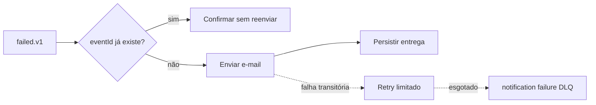

# notification-worker

## Summary

Worker assíncrono que notifica o usuário quando um job termina em falha. Ele é separado do processor porque SMTP tem disponibilidade, latência e política de retry próprias. Não consulta tabelas da API; usa somente sua persistência para idempotência e auditoria.

## Responsabilidades de negócio

- consumir `video.job.failed.v1`;
- ignorar eventos já entregues com base em `eventId`;
- montar e enviar e-mail de falha;
- registrar a entrega no banco próprio;
- enviar mensagens não processáveis para DLQ após retry limitado.

## Fluxo



## Ferramentas

- Spring AMQP para consumo e retry;
- Spring Mail para SMTP;
- Spring Data JPA e PostgreSQL para auditoria;
- Flyway para migrations;
- MailHog no desenvolvimento;
- Actuator, Micrometer e Prometheus.

## Eventos e persistência

- Consome `video.job.failed.v1` pela fila `video.notifications.failure.v1`.
- DLQ: `video.notifications.failure.dlq.v1`.
- Tabela própria: `notification_deliveries`, com unique constraint em `event_id`.

O evento deveria conter o destinatário já autorizado ou uma referência resolvível por uma API própria. O fallback `dev@fiapx.local` existe apenas para a fundação local.

## Configuração

| Variável | Padrão local | Uso |
|---|---|---|
| `SERVER_PORT` | `8082` | management/Actuator |
| `NOTIFICATION_DATABASE_URL` | banco local de notificações | JDBC URL |
| `DATABASE_USER` | `fiapx` | usuário PostgreSQL |
| `DATABASE_PASSWORD` | `fiapx` | senha PostgreSQL |
| `RABBITMQ_HOST` | `localhost` | host do broker |
| `RABBITMQ_USER` | `fiapx` | usuário do broker |
| `RABBITMQ_PASSWORD` | `fiapx` | senha do broker |
| `SMTP_HOST` | `localhost` | servidor SMTP |
| `SMTP_PORT` | `1025` | porta SMTP |

## Executar e testar

```bash
./mvnw -pl services/notification-worker -am clean verify
./mvnw -pl services/notification-worker -am spring-boot:run
```

PostgreSQL, RabbitMQ e SMTP devem estar disponíveis. Use o Compose raiz para provisionar o ambiente completo e consulte mensagens em `http://localhost:8025`.

## Idempotência e consistência

A unique constraint evita duas linhas para o mesmo evento. Contudo, SMTP e PostgreSQL não compartilham transação: uma queda depois do envio e antes do `INSERT` pode duplicar o e-mail. Para reduzir o risco, adote uma tabela de intenção com estados, um provedor que aceite idempotency key ou uma caixa de saída dedicada de notificações.

## Observabilidade

Monitore entregas, duplicatas ignoradas, latência SMTP, retries, falhas por categoria e profundidade da DLQ. Logs não devem conter conteúdo sensível ou endereço completo sem necessidade operacional.

## CI/CD

O CI raiz compila o módulo e valida o Compose. A entrega deve construir e escanear a imagem específica, aplicar a migration compatível e usar smoke test contra servidor SMTP de teste. Deploys devem preservar consumers antigos enquanto houver eventos compatíveis em trânsito.

## Próximos passos

- templates HTML/text versionados e localização;
- destinatário obrigatório no contrato;
- classificação de erros SMTP permanentes e transitórios;
- estratégia de idempotência para o side effect externo;
- testes Testcontainers e servidor SMTP fake;
- política de retenção e privacidade da auditoria.
