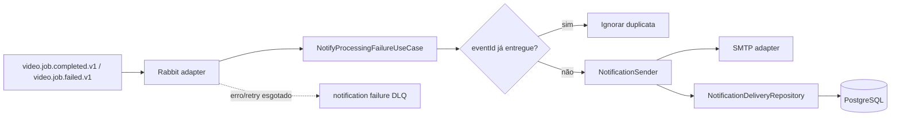

# notification-worker

## Objetivo

Worker assíncrono responsável por notificar o usuário quando o processamento de um vídeo termina, com sucesso ou com falha.
Este módulo foi organizado seguindo Clean Architecture para manter as regras de negócio independentes de RabbitMQ,
SMTP, JPA e Spring.

> Escopo: a reorganização arquitetural está restrita a `services/notification-worker`.

## Responsabilidades de negócio

- consumir `video.job.completed.v1` e `video.job.failed.v1`;
- ignorar eventos já entregues com base em `eventId`;
- montar a notificação de falha;
- enviar o e-mail;
- registrar a entrega no banco próprio;
- encaminhar mensagens não processáveis para DLQ após retry limitado.

## Clean Architecture

A dependência do código aponta para dentro:

```text
Infrastructure  --->  Application  --->  Domain
     |                    |
     +------ implements --+ (ports)
```

### Estrutura

```text
br.com.fiapx.notification
├── NotificationWorkerApplication.java
├── domain
│   └── model
│       ├── FailureNotification.java
│       └── NotificationDelivery.java
├── application
│   ├── port
│   │   ├── in
│   │   │   ├── NotificationResult.java
│   │   │   └── NotifyProcessingFailureUseCase.java
│   │   └── out
│   │       ├── NotificationDeliveryRepository.java
│   │       ├── NotificationSender.java
│   │       └── OutboundNotification.java
│   └── service
│       └── NotifyProcessingFailureService.java
└── infrastructure
    ├── config
    │   ├── ApplicationConfiguration.java
    │   └── NotificationProperties.java
    ├── mail
    │   └── SmtpNotificationSender.java
    ├── messaging/rabbit
    │   ├── FailureEventListener.java
    │   ├── FailureEventMapper.java
    │   ├── FailureEventMessage.java
    │   └── RabbitMessagingConfiguration.java
    └── persistence/jpa
        ├── JpaNotificationDeliveryRepositoryAdapter.java
        ├── NotificationDeliveryEntity.java
        └── SpringDataNotificationDeliveryRepository.java
```

### Camadas

**Domain** contém apenas os modelos e invariantes do worker. Não conhece Spring, RabbitMQ, SMTP ou JPA.

**Application** contém o caso de uso e as portas de entrada/saída. O fluxo de negócio depende somente do domínio e de
interfaces próprias.

**Infrastructure** contém os detalhes tecnológicos. RabbitMQ é o adaptador de entrada; SMTP e PostgreSQL/JPA são
adaptadores de saída. A configuração Spring conecta as implementações às portas da aplicação.

## Fluxo



## Boas práticas aplicadas

- inversão de dependência por portas de entrada e saída;
- domínio sem dependência de framework; a validação Jakarta fica nos objetos de entrada/saída onde é necessária;
- DTO do RabbitMQ isolado do modelo de domínio;
- entidade JPA separada do domínio;
- configuração externa para remetente e destinatário de fallback;
- `Clock` injetável para remover dependência implícita de `Instant.now()` e facilitar testes;
- validação defensiva dos dados essenciais do evento;
- limite de 500 caracteres para o motivo recebido no evento;
- nomes de exchange, filas e routing keys centralizados;
- logs com `eventId` e `jobId`, sem registrar o endereço completo do destinatário ou o conteúdo do erro;
- `open-in-view` desabilitado;
- testes unitários para o caso de uso e o mapeamento do evento;
- uso criterioso de Lombok para reduzir boilerplate (`@RequiredArgsConstructor`, `@Slf4j`, `@Getter` e `@NoArgsConstructor`);
- evitado `@Data` em entidades JPA e modelos de domínio para não gerar `equals/hashCode`, setters e outros comportamentos indesejados automaticamente.

## Lombok

O módulo utiliza Lombok apenas onde ele reduz código repetitivo sem esconder regra de negócio. Construtores de dependências
são gerados com `@RequiredArgsConstructor`, logs com `@Slf4j`, o mapper estático com `@NoArgsConstructor(access = PRIVATE)` e a entidade JPA
usa `@Getter` + `@NoArgsConstructor(access = PROTECTED)`. Os modelos e DTOs foram mantidos como classes Java convencionais,
com Lombok para getters, setters e construtores quando apropriado; não são utilizados `record`s neste módulo.

## Eventos e persistência

- Consome `video.job.completed.v1` e `video.job.failed.v1` pela fila `video.notifications.failure.v1`.
- DLQ: `video.notifications.failure.dlq.v1`.
- Tabela própria: `notification_deliveries`, com unicidade em `event_id`.

`recipient` e `videoName` são opcionais. Sem destinatário, o worker usa `app.notification.default-recipient`.
Sem nome do vídeo, o texto fala em "seu vídeo". O id do job não entra no e-mail. `video.job.started.v1` não gera e-mail.

## Configuração

| Variável                         | Padrão local                | Uso |
|----------------------------------|-----------------------------|-----|
| `SERVER_PORT`                    | `8082`                      | management/Actuator |
| `NOTIFICATION_DATABASE_URL`      | banco local de notificações | JDBC URL |
| `DATABASE_USER`                  | `fiapx`                     | usuário PostgreSQL |
| `DATABASE_PASSWORD`              | `fiapx`                     | senha PostgreSQL |
| `RABBITMQ_HOST`                  | `localhost`                 | host do broker |
| `RABBITMQ_USER`                  | `fiapx`                     | usuário do broker |
| `RABBITMQ_PASSWORD`              | `fiapx`                     | senha do broker |
| `RABBITMQ_LISTENER_CONCURRENCY`   | `1`                         | consumidores concorrentes iniciais |
| `RABBITMQ_LISTENER_MAX_CONCURRENCY` | `8`                       | limite de consumidores concorrentes |
| `RABBITMQ_LISTENER_PREFETCH`      | `10`                        | mensagens pré-buscadas por consumidor |
| `SMTP_HOST`                      | `localhost`                 | servidor SMTP |
| `SMTP_PORT`                      | `1025`                      | porta SMTP |
| `NOTIFICATION_DEFAULT_RECIPIENT` | `dev@fiapx.local`           | fallback enquanto o evento não traz destinatário |
| `NOTIFICATION_FROM_ADDRESS`      | `noreply@fiapx.local`       | remetente do e-mail |

## Executar e testar

```bash
./mvnw -pl services/notification-worker -am clean test
./mvnw -pl services/notification-worker -am spring-boot:run
```

PostgreSQL, RabbitMQ e SMTP devem estar disponíveis para execução da aplicação. Os testes unitários do caso de uso não
dependem desses serviços externos.

## Idempotência e consistência

O worker consulta `eventId` antes do envio e mantém `event_id` como chave única na auditoria. Isso evita o reenvio em
redeliveries normais já persistidas.

SMTP e PostgreSQL, entretanto, não compartilham a mesma transação. Se o e-mail for aceito pelo servidor e o processo cair
antes da persistência, uma nova entrega poderá reenviar o e-mail. Esse limite já faz parte da arquitetura do sistema e
pode ser reduzido futuramente com uma tabela de intenção/state machine ou com um provedor de e-mail que aceite chave de
idempotência.

## Observabilidade

O worker expõe Actuator via HTTP na porta configurada em `SERVER_PORT`, incluindo `/actuator/health` e
`/actuator/prometheus`. O `micrometer-registry-prometheus` disponibiliza as métricas para coleta por Prometheus.

Monitorar entregas, duplicatas ignoradas, latência SMTP, retries, falhas por categoria e profundidade da DLQ. Logs não
devem conter conteúdo sensível ou endereço de e-mail completo sem necessidade operacional.

## Aderência ao Hackathon da pós - escopo do notification-worker

| Requisito relacionado ao worker | Situação | Implementação |
|----------------------------------|----------|---------------|
| Notificar o usuário em caso de erro | Atende no worker | O worker envia e-mail de sucesso e de falha. O destinatário e o nome do vídeo vêm do evento; sem destinatário, usa o fallback configurável. |
| Mensageria | Atende | RabbitMQ, fila durável, retry limitado e DLQ. |
| Persistência | Atende | PostgreSQL/JPA com migration Flyway e unicidade por `event_id`. |
| Arquitetura escalável | Atende no worker | Serviço sem estado local, consumidores concorrentes configuráveis e possibilidade de múltiplas réplicas consumindo a mesma fila. |
| Testes | Atende como base | Testes unitários cobrem domínio, mapeamento e principal caso de uso. Testes de integração podem ser adicionados como evolução. |
| Containers | Atende | Dockerfile próprio; no projeto completo o serviço é executado via Docker Compose. |
| Monitoramento | Atende no worker | Actuator + Micrometer + endpoint Prometheus. A coleta/visualização depende da infraestrutura do projeto. |
| CI/CD | Atende no repositório | O pipeline do repositório executa `clean verify`, incluindo este módulo. |
| Documentação da arquitetura | Atende | Este README documenta responsabilidades, camadas, fluxo, idempotência e observabilidade. |
| Script de criação dos dados | Atende | `V1__notification_schema.sql` cria a tabela utilizada pelo worker. |

Os requisitos de autenticação, listagem de status e processamento simultâneo de vídeos pertencem aos serviços responsáveis
por entrada/consulta e processamento, portanto não devem ser implementados dentro deste worker apenas para reproduzir o
enunciado.


## Validation

O módulo utiliza `spring-boot-starter-validation`/Jakarta Bean Validation nas bordas da aplicação. O evento recebido do RabbitMQ valida identificadores, formato do e-mail e tamanhos antes do mapeamento para o domínio. As propriedades de configuração são validadas no startup e `OutboundNotification` possui constraints de destinatário, assunto e corpo, aplicadas no adapter SMTP por method validation (`@Validated` + `@Valid`). As invariantes dos modelos de domínio permanecem protegidas no próprio domínio para não depender do Spring.
