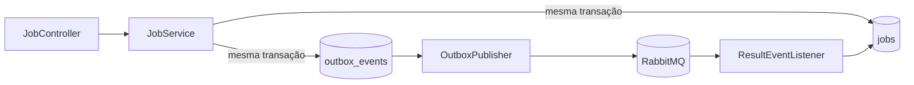

# video-api

## Summary

Aplicação de entrada e proprietária do ciclo de vida dos jobs. Valida bearer JWT, cria e consulta jobs, grava comandos em uma outbox transacional e consome eventos do processor para atualizar o estado. Não processa mídia e nenhum outro serviço deve escrever em suas tabelas.

## Responsabilidades de negócio

- receber uma `sourceKey` e criar um job `PENDING`;
- associar o job ao `sub` do JWT, tratado como UUID do usuário;
- persistir job e `video.job.requested.v1` na mesma transação;
- publicar registros pendentes da outbox no RabbitMQ;
- consumir `started`, `completed` e `failed` para atualizar jobs;
- expor consulta do estado atual.

## Fluxo interno



## API atual

| Método | Endpoint | Descrição |
|---|---|---|
| `POST` | `/v1/jobs` | cria job a partir de `sourceKey` |
| `GET` | `/v1/jobs/{id}` | consulta job |
| `GET` | `/actuator/health` | health check |
| `GET` | `/actuator/prometheus` | métricas |

Todas as rotas de negócio exigem JWT. O contrato detalhado está em [`../../contracts/openapi.yaml`](../../contracts/openapi.yaml).

## Persistência

Flyway cria `jobs`, `job_status_history` e `outbox_events`. PostgreSQL é a fonte de verdade. `spring.jpa.hibernate.ddl-auto=validate` impede que Hibernate altere o schema silenciosamente.

Limitação atual: a tabela de histórico existe, mas ainda não é populada; o result listener também precisa de uma inbox persistente e validação de transições fora de ordem.

## Eventos

- Produz: `video.job.requested.v1`.
- Consome: `video.job.started.v1`, `video.job.completed.v1`, `video.job.failed.v1`.
- Fila: `video.api.results.v1`.
- DLQ: `video.api.results.dlq.v1`.

## Configuração

| Variável | Padrão local | Uso |
|---|---|---|
| `SERVER_PORT` | `8080` | porta HTTP |
| `DATABASE_URL` | `jdbc:postgresql://localhost:5432/fiapx` | JDBC URL |
| `DATABASE_USER` | `fiapx` | usuário PostgreSQL |
| `DATABASE_PASSWORD` | `fiapx` | senha PostgreSQL |
| `RABBITMQ_HOST` | `localhost` | host do broker |
| `RABBITMQ_USER` | `fiapx` | usuário do broker |
| `RABBITMQ_PASSWORD` | `fiapx` | senha do broker |
| `JWT_SECRET` | valor inseguro local | chave HMAC para validar JWT |

## Executar e testar

Na raiz do monorepo:

```bash
./mvnw -pl services/video-api -am clean verify
./mvnw -pl services/video-api -am spring-boot:run
```

Para execução funcional, PostgreSQL e RabbitMQ devem estar disponíveis. O Compose raiz provisiona ambos.

## Segurança

A aplicação é resource server e não emite tokens. Produção deve migrar de HMAC compartilhado para OIDC/JWKS, validar issuer/audience e autorizar leitura por proprietário. O endpoint atual busca por ID sem filtrar `userId`; isso é uma lacuna conhecida e deve ser corrigida antes de exposição real.

## Observabilidade

Health, readiness/liveness e Prometheus são expostos pelo Actuator. Métricas recomendadas: jobs por estado, duração por estado, idade e tamanho da outbox, falhas de publicação, duplicatas e mensagens na DLQ.

## CI/CD

O CI raiz compila o módulo em Java 21 durante `clean verify`. Uma esteira de entrega deverá construir `services/video-api/Dockerfile`, escanear dependências e imagem, publicar por digest e promover a mesma imagem entre ambientes. Migrations devem ser testadas antes do rollout; deploy deve aguardar readiness e manter compatibilidade com consumidores da versão anterior.

## Próximos passos

- endpoints de autenticação/integração OIDC;
- URLs pré-assinadas para upload e download;
- autorização por proprietário;
- inbox idempotente e máquina de estados;
- publisher confirms e claim concorrente da outbox;
- testes Testcontainers de PostgreSQL e RabbitMQ.
