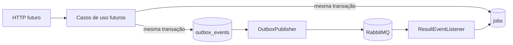

# video-api

## Summary

Fundação executável do serviço de entrada. Hoje ela sobe como Spring Boot, expõe health anonimamente e serve Swagger/OpenAPI local no perfil `local`. O restante da arquitetura de jobs, outbox, resultados e autenticação está documentado como roadmap dos próximos épicos.

## Executável hoje

| Surface | State |
|---|---|
| `GET /actuator/health` | implementado e anônimo |
| `GET /openapi.yaml` | implementado no perfil `local` |
| `GET /swagger-ui.html` | implementado no perfil `local` |
| `GET /v3/api-docs` | bloqueado pela segurança desta fundação |
| `POST /v1/jobs`, `GET /v1/jobs/{id}` | não implementados nesta fundação |

## Roadmap de responsabilidade

- receber `sourceKey`, criar job e aplicar estados;
- associar o job ao usuário autenticado;
- registrar outbox transacional e publicar no RabbitMQ;
- consumir eventos do processor e atualizar o estado;
- expor consulta de jobs e autorização por proprietário.



## Configuração atual

| Variável | Padrão local | Uso |
|---|---|---|
| `SERVER_PORT` | `8080` | porta HTTP |
| `DATABASE_URL` | `jdbc:postgresql://localhost:5432/fiapx` | JDBC URL |
| `DATABASE_USER` | `fiapx` | usuário PostgreSQL |
| `DATABASE_PASSWORD` | `fiapx` | senha PostgreSQL |

RabbitMQ e JWT ainda não são dependências funcionais desta fundação. `JWT_SECRET` e qualquer integração de identidade ficam para o ADR 0010 e para os épicos de autenticação.

## Como executar

Na raiz do monorepo:

```bash
./mvnw -pl services/video-api -am clean verify
docker compose up postgres video-api
```

Para Swagger local, inicie o serviço com o perfil `local` e um PostgreSQL acessível:

```bash
SPRING_PROFILES_ACTIVE=local \
DATABASE_URL=jdbc:postgresql://localhost:5432/fiapx \
DATABASE_USER=fiapx \
DATABASE_PASSWORD=fiapx \
./mvnw -pl services/video-api -am spring-boot:run
```

## Segurança

A fundação não emite tokens nem implementa autenticação. O ADR 0010 registra a evolução futura: HMAC apenas para desenvolvimento local e OIDC/JWKS para ambientes não locais. Fora de `local`, HMAC compartilhado é proibido.

## Observabilidade

O health é o único sinal operacional já exposto como contrato público desta fundação. Métricas de jobs, outbox, redelivery, DLQ e tracing entre HTTP e AMQP pertencem aos épicos que introduzirem comportamento de negócio.

## Próximos passos

- autenticação e autorização por proprietário;
- create/get job com estados e histórico;
- outbox, publisher confirms e listeners idempotentes;
- integrações reais de processor e worker;
- métricas e alertas de negócio.
