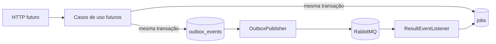

# video-api

## Summary

Serviço de entrada Spring Boot que expõe health, documentação local, autenticação local e a futura superfície de jobs.

## Executável hoje

| Surface | State |
|---|---|
| `GET /actuator/health` | implementado e anônimo |
| `GET /openapi.yaml` | implementado no perfil `local` |
| `GET /swagger-ui.html` | implementado no perfil `local` |
| `GET /v3/api-docs` | bloqueado pela segurança desta fundação |
| `POST /v1/auth/register`, `POST /v1/auth/login` | cadastro e login local |
| `POST /v1/auth/refresh`, `POST /v1/auth/logout` | sessão rotativa por cookie e CSRF |
| `POST /v1/jobs`, `GET /v1/jobs/{id}` | bearer JWT obrigatório; criação exige vídeo confirmado e aceita `Idempotency-Key` |

## Roadmap de responsabilidade

- persistir metadados de vídeo e confirmar seu lifecycle antes do job;
- associar o job ao usuário autenticado e deduplicar criações por `Idempotency-Key`;
- registrar job, histórico inicial e outbox na mesma transação;
- deduplicar resultados na inbox e atualizar o agregado com optimistic locking;
- fazer claim durável da outbox com retry e autorização por proprietário.



## Autenticação e configuração

| Variável | Padrão local | Uso |
|---|---|---|
| `SERVER_PORT` | `8080` | porta HTTP |
| `DATABASE_URL` | `jdbc:postgresql://localhost:5432/fiapx` | JDBC URL |
| `DATABASE_USER` | `fiapx` | usuário PostgreSQL |
| `DATABASE_PASSWORD` | `fiapx` | senha PostgreSQL |
| `APP_AUTH_ISSUER` | obrigatório fora de local | emissor JWT |
| `APP_AUTH_AUDIENCE` | obrigatório fora de local | audiência JWT |
| `APP_AUTH_KEY_ID` | obrigatório fora de local | identificador da chave RSA |
| `APP_AUTH_PRIVATE_KEY_BASE64` | obrigatório fora de local | chave RSA PKCS#8 em Base64 |
| `APP_AUTH_PUBLIC_KEY_BASE64` | obrigatório fora de local | chave RSA X.509 em Base64 |
| `APP_AUTH_BOOTSTRAP_ENABLED` | `false` | habilita criação idempotente do primeiro ADMIN |
| `APP_AUTH_BOOTSTRAP_EMAIL` / `APP_AUTH_BOOTSTRAP_PASSWORD` | — | segredo externo exigido quando bootstrap está ativo |

O perfil `local` usa par RSA efêmero e permite cookies sem `Secure`. Fora dele, todas as chaves e identificadores
acima são obrigatórios. O access token dura quinze minutos; o refresh token dura sete dias e é entregue apenas no
cookie `FIAPX_REFRESH` (`HttpOnly`, `SameSite=Strict`). Após login, o cliente deve copiar `XSRF-TOKEN` para o header
`X-XSRF-TOKEN` ao chamar refresh ou logout.

## Como executar

Na raiz do monorepo:

```bash
./mvnw -pl services/video-api -am clean verify
docker compose up postgres video-api
```

Para Swagger local, inicie o serviço com o perfil `local` e um PostgreSQL acessível:

```bash
SPRING_PROFILES_ACTIVE=local \
DATABASE_URL=jdbc:postgresql://localhost:5432/fiapx \
DATABASE_USER=fiapx \
DATABASE_PASSWORD=fiapx \
./mvnw -pl services/video-api -am spring-boot:run
```

## Segurança

Senhas são armazenadas com `DelegatingPasswordEncoder`/BCrypt; nunca são registradas em logs. Após cinco falhas
consecutivas, o login é bloqueado por quinze minutos. JWTs usam `RS256` e são validados por assinatura, issuer,
audience, expiração e sessão. O [ADR 0011](../../docs/adr/0011-local-identity-with-rsa-jwt-and-oidc-boundary.md)
documenta a transição futura para OIDC/JWKS.

## Observabilidade

O health é o único sinal operacional já exposto como contrato público desta fundação. Métricas de jobs, outbox, redelivery, DLQ e tracing entre HTTP e AMQP pertencem aos épicos que introduzirem comportamento de negócio.

## Persistência

Flyway executa `V1`, `V2` e `V3` sem alterar migrations já publicadas. A `V3`
normaliza usuários em `users`, `user_credentials` e `user_roles`, mantém dados
legados durante a transição e adiciona vídeos, inbox, idempotência, histórico e
metadados de claim/retry da outbox. Veja o [DER](../../docs/architecture/video-api-database.md).

## Próximos passos

- autenticação e autorização por proprietário;
- create/get job com estados e histórico;
- outbox, publisher confirms e listeners idempotentes;
- integrações reais de processor e worker;
- métricas e alertas de negócio.
