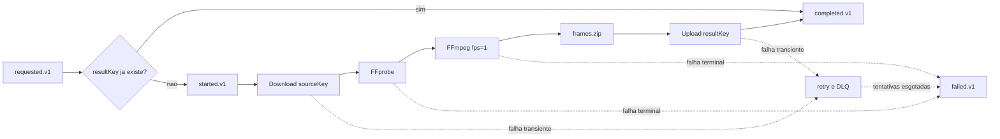

# video-processor

## Summary

Worker assíncrono responsável pelo trabalho pesado de mídia. Consome solicitações, baixa o vídeo do object storage,
valida com FFprobe, extrai um frame por segundo com FFmpeg, compacta os frames e envia o ZIP de volta ao storage.
Comunica o resultado apenas por eventos; não acessa o banco da API.

## Responsabilidades de negócio

- consumir `video.job.requested.v1`;
- ignorar reprocessamento de um job cujo resultado já está armazenado;
- validar se o objeto é uma mídia legível;
- extrair frames com padrão determinístico;
- produzir um ZIP por job;
- armazenar o resultado em `results/{jobId}/frames.zip`;
- publicar progresso e resultado;
- remover arquivos temporários ao final.

## Pipeline de mídia



## Ferramentas

- Spring Boot e Spring AMQP para lifecycle e consumo;
- MinIO Java SDK para API S3-compatible;
- FFprobe para validação/metadados;
- FFmpeg para extração de frames;
- `java.util.zip` para compactação;
- Actuator, Micrometer e Prometheus.

## Organização do código

O módulo segue arquitetura limpa dentro da capability `processing`:

```text
br.com.fiapx.videoprocessor.processing
├── domain/           VideoJob, ResultLocation, JobEvent, MediaMetadata, TerminalProcessingException
├── application/      ProcessVideoJobService e as portas de entrada/saída
└── infrastructure/   messaging (RabbitMQ), storage (MinIO), media (FFprobe/FFmpeg/ZIP), workspace, config
```

O domínio e a aplicação não conhecem Spring, AMQP nem MinIO. As implementações
das portas vivem em `infrastructure`, e o caso de uso é instanciado por
`ProcessingConfig`, o que mantém a camada de aplicação livre de anotações de
framework.

## Eventos e entrega

- Consome da fila `video.processing.v1`, binding `video.job.requested.v1` no exchange `video.events`.
- Produz `video.job.started.v1` (`type=PROCESSING`), `video.job.completed.v1` e `video.job.failed.v1`.
- Todo evento publicado carrega `eventId`, `jobId`, `type`, `schemaVersion`, `occurredAt` e `correlationId`.
- Após quatro tentativas com backoff, a mensagem rejeitada segue para `video.processing.dlq.v1` pelo exchange `video.events.dlx`.

O worker não publica `recipient`: a requisição só traz `userId`, e resolver o
endereço é responsabilidade do `notification-worker`.

### Idempotência

O `resultKey` é determinístico (`results/{jobId}/frames.zip`), então o próprio
objeto armazenado é o registro de deduplicação. Antes de qualquer trabalho caro
o worker verifica se o ZIP já existe; se existir, republica
`video.job.completed.v1` e confirma a mensagem sem baixar nem reprocessar o
vídeo. Isso torna a redistribuição segura sem introduzir banco de dados no
serviço.

Como o worker não possui banco, não há transação de estado a coordenar com o
broker, e por isso ele não usa outbox: a publicação acontece depois do upload
íntegro do ZIP, e uma eventual duplicata é absorvida pelo guard determinístico.

### Falhas transientes e terminais

| Situação | Tratamento |
|---|---|
| Mídia ilegível, sem stream de vídeo, indecodificável, longa demais ou sem frames | `video.job.failed.v1` com `terminal=true` e ack; a mensagem não vai para a DLQ porque a falha já está registrada no fluxo de eventos |
| Falha de rede, storage ou I/O | A exceção escapa, o container repete com backoff e, ao esgotar as tentativas, `FailedEventMessageRecoverer` publica `video.job.failed.v1 terminal=true` antes de enviar a mensagem para a DLQ |
| Payload malformado ou sem campo obrigatório | Rejeitado sem retry e enviado direto para a DLQ |

O `reason` publicado é sempre uma mensagem segura para exibição: nunca contém
stack trace, linha de comando, object key interna ou credencial.

## Configuração

| Variável | Padrão local | Uso |
|---|---|---|
| `SERVER_PORT` | `8081` | management/Actuator |
| `RABBITMQ_HOST` | `localhost` | host do broker |
| `RABBITMQ_USER` | `fiapx` | usuário do broker |
| `RABBITMQ_PASSWORD` | `fiapx` | senha do broker |
| `RABBITMQ_EXCHANGE` | `video.events` | exchange topic dos eventos |
| `RABBITMQ_QUEUE` | `video.processing.v1` | fila de trabalho |
| `RABBITMQ_DLX` | `video.events.dlx` | exchange de dead-letter |
| `RABBITMQ_DLQ` | `video.processing.dlq.v1` | fila de dead-letter |
| `RABBITMQ_PREFETCH` | `1` | mensagens em voo por consumidor |
| `RABBITMQ_CONCURRENCY` | `1` | consumidores mínimos |
| `RABBITMQ_MAX_CONCURRENCY` | `2` | consumidores máximos |
| `S3_ENDPOINT` | `http://localhost:9000` | endpoint S3-compatible |
| `AWS_ACCESS_KEY_ID` | credencial local | access key local para MinIO |
| `AWS_SECRET_ACCESS_KEY` | credencial local | secret key local para MinIO |
| `AWS_REGION` | `us-east-1` | região do bucket |
| `S3_BUCKET` | `videos` | bucket de entrada/saída |
| `FFMPEG_PATH` | `ffmpeg` | executável do FFmpeg |
| `FFPROBE_PATH` | `ffprobe` | executável do FFprobe |
| `FRAMES_PER_SECOND` | `1` | frames extraídos por segundo de vídeo |
| `MEDIA_MAX_DURATION` | `30m` | duração máxima aceita |
| `MEDIA_COMMAND_TIMEOUT` | `5m` | timeout por invocação de FFprobe/FFmpeg |
| `WORKSPACE_ROOT` | diretório temporário do sistema | raiz das áreas de trabalho por job |

## Executar e testar

FFmpeg e FFprobe precisam estar no `PATH` para execução fora do container.

```bash
./mvnw -pl services/video-processor -am clean verify
./mvnw -pl services/video-processor -am spring-boot:run
```

Os testes unitários não exigem FFmpeg, RabbitMQ nem MinIO: os adapters de mídia
recebem um `CommandRunner` falso que registra a lista de argumentos, e as portas
de storage e messaging são simuladas.

O Dockerfile instala FFmpeg e executa a aplicação como usuário sem privilégios.

## Recursos e escala

O worker é CPU/I/O intensive. Concorrência deve ser limitada por capacidade real de CPU, memória e disco temporário, não
apenas pela profundidade da fila. Configure prefetch e consumidores concorrentes depois de medir tamanho e duração dos
vídeos. O diretório temporário deve possuir quota; arquivos devem ter limites de tamanho, duração e formato.

## Segurança

Em produção, use credenciais exclusivas com permissão somente para ler o prefixo de entrada e gravar o prefixo de
resultados. Valide MIME real, duração, dimensões e tamanho; aplique timeout aos subprocessos; nunca construa comandos
via shell. A implementação usa `ProcessBuilder` com lista de argumentos, reduzindo risco de command injection.

## Observabilidade

Além das métricas Actuator, monitore tempo de download, FFprobe, FFmpeg, compactação e upload; bytes processados; frames
por job; disco temporário; retries; profundidade da fila e DLQ. Logs devem incluir `jobId`, `eventId` e etapa.

## CI/CD

O CI raiz compila o módulo. A entrega deve construir o Dockerfile específico, verificar a versão e vulnerabilidades do
FFmpeg, gerar SBOM, publicar imagem imutável e executar smoke test com um vídeo curto. Rollout e autoscaling devem
respeitar drain de consumers para não interromper jobs no meio.

## Próximos passos

- limite de tamanho do objeto de entrada e quota do disco temporário;
- métricas por etapa do pipeline e correlação nos logs estruturados;
- testes de integração com Testcontainers (RabbitMQ e MinIO) e vídeos reais, válidos e corrompidos;
- ajuste de prefetch e concorrência a partir de medição de CPU, memória e disco.
