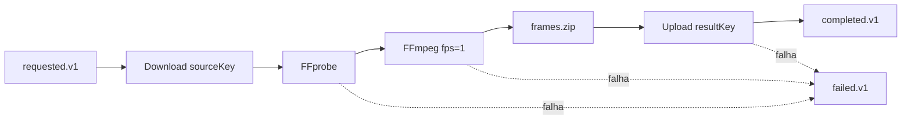

# video-processor

## Summary

Worker assíncrono responsável pelo trabalho pesado de mídia. Consome solicitações, baixa o vídeo do object storage, valida com FFprobe, extrai um frame por segundo com FFmpeg, compacta os frames e envia o ZIP de volta ao storage. Comunica o resultado apenas por eventos; não acessa o banco da API.

## Responsabilidades de negócio

- consumir `video.job.requested.v1`;
- validar se o objeto é uma mídia legível;
- extrair frames com padrão determinístico;
- produzir um ZIP por job;
- armazenar o resultado em `results/{jobId}/frames.zip`;
- publicar progresso e resultado;
- remover arquivos temporários ao final.

## Pipeline de mídia



## Ferramentas

- Spring Boot e Spring AMQP para lifecycle e consumo;
- MinIO Java SDK para API S3-compatible;
- FFprobe para validação/metadados;
- FFmpeg para extração de frames;
- `java.util.zip` para compactação;
- Actuator, Micrometer e Prometheus.

## Eventos e entrega

- Consome da fila `video.processing.v1`, binding `video.job.requested.v1`.
- Produz `video.job.started.v1`, `video.job.completed.v1` e `video.job.failed.v1`.
- Após quatro tentativas com backoff, a mensagem rejeitada segue para `video.processing.dlq.v1`.

O `resultKey` é determinístico, o que torna uploads repetidos substituíveis. Ainda é necessária uma inbox persistente ou estratégia equivalente para impedir processamento duplicado caro.

## Configuração

| Variável | Padrão local | Uso |
|---|---|---|
| `SERVER_PORT` | `8081` | management/Actuator |
| `RABBITMQ_HOST` | `localhost` | host do broker |
| `RABBITMQ_USER` | `fiapx` | usuário do broker |
| `RABBITMQ_PASSWORD` | `fiapx` | senha do broker |
| `S3_ENDPOINT` | `http://localhost:9000` | endpoint S3-compatible |
| `S3_ACCESS_KEY` | `fiapx` | access key |
| `S3_SECRET_KEY` | `fiapx-secret` | secret key |
| `S3_BUCKET` | `videos` | bucket de entrada/saída |

## Executar e testar

FFmpeg e FFprobe precisam estar no `PATH` para execução fora do container.

```bash
./mvnw -pl services/video-processor -am clean verify
./mvnw -pl services/video-processor -am spring-boot:run
```

O Dockerfile instala FFmpeg e executa a aplicação como usuário sem privilégios.

## Recursos e escala

O worker é CPU/I/O intensive. Concorrência deve ser limitada por capacidade real de CPU, memória e disco temporário, não apenas pela profundidade da fila. Configure prefetch e consumidores concorrentes depois de medir tamanho e duração dos vídeos. O diretório temporário deve possuir quota; arquivos devem ter limites de tamanho, duração e formato.

## Segurança

Em produção, use credenciais exclusivas com permissão somente para ler o prefixo de entrada e gravar o prefixo de resultados. Valide MIME real, duração, dimensões e tamanho; aplique timeout aos subprocessos; nunca construa comandos via shell. A implementação usa `ProcessBuilder` com lista de argumentos, reduzindo risco de command injection.

## Observabilidade

Além das métricas Actuator, monitore tempo de download, FFprobe, FFmpeg, compactação e upload; bytes processados; frames por job; disco temporário; retries; profundidade da fila e DLQ. Logs devem incluir `jobId`, `eventId` e etapa.

## CI/CD

O CI raiz compila o módulo. A entrega deve construir o Dockerfile específico, verificar a versão e vulnerabilidades do FFmpeg, gerar SBOM, publicar imagem imutável e executar smoke test com um vídeo curto. Rollout e autoscaling devem respeitar drain de consumers para não interromper jobs no meio.

## Próximos passos

- classificar falhas transitórias e terminais;
- só emitir falha terminal depois de esgotar retry;
- timeout e cancelamento dos processos de mídia;
- inbox/deduplicação persistente;
- limites de mídia e proteção de disco;
- testes com vídeos válidos, corrompidos e formatos variados.
